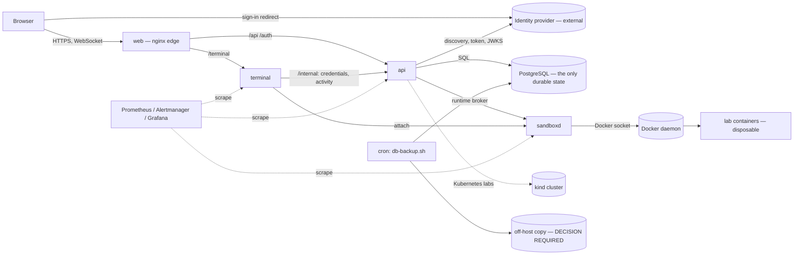

# Reliability: failure domains, journeys, failure matrix, recovery numbers

What breaks, what a student sees when it does, what notices, what recovers by
itself, and what an operator does. Every "measured" value below comes from a
drill on a disposable compose stack (reliability audit 2026-09-28,
[report](releases/reliability-dr-audit-2026-09-28.md)); every "derived" value
is read from configuration and says so.

**How to read the numbers.** The drills ran on a 10-CPU, 16 GB laptop with
Docker Desktop, shared by several other stacks, at a load average of **35–63**
throughout. That inflates everything that starts a Node process: the api
transpiles TypeScript at boot and took **290–650 s** to listen here. On an
otherwise idle host expect far less. Treat these as an upper bound and as the
*shape* of each recovery, and re-measure on the real host (production-host
readiness §17 drills).

Related: incident handling [runbooks/incident-management.md](runbooks/incident-management.md),
symptoms [runbooks/private-beta-incident-response.md](runbooks/private-beta-incident-response.md),
alerts [runbooks/README.md](runbooks/README.md), indicators
[beta-slo-indicators.md](beta-slo-indicators.md), disaster recovery
[runbooks/disaster-recovery.md](runbooks/disaster-recovery.md).

## 1. Failure domains

One host. Everything below fails with it (§5).

| Domain | State it holds | If it is lost | Restart cost (measured here) |
|---|---|---|---|
| PostgreSQL | accounts, progress, attempts, sign-ins, session rows, migration ledger | everything since the last backup (§4) | fresh volume healthy in 59–81 s |
| api | none durable (sessions are rows) | every student request fails; running labs keep running | 290–650 s cold start |
| terminal | PTY relays in memory | open terminals drop; shells in the sandbox survive | 72–165 s |
| sandboxd | attach streams in memory | container-track Start/Reset/End fail fast; open shells drop | 67–143 s to healthy |
| Docker / lab containers | the student's work inside the lab | the lab's contents | labs are `--restart no`: they stay stopped (§5) |
| web (nginx) | none | the site; the api keeps its state | seconds |
| Identity provider | external | new sign-ins only | not ours |
| Observability | 15 days of metrics | visibility, not service | — |

## 2. Critical journeys

| Journey | Depends on | How it fails | Signal | Recovery |
|---|---|---|---|---|
| Sign in | web, api, PostgreSQL, identity provider | provider down → 503 `AUTH_PROVIDER_UNAVAILABLE`; DB down → 503 `AUTH_UNAVAILABLE` | `IdentityProviderUnreachable`, `DatabaseDown` | by itself when the dependency returns (7–8 s after the provider, 12 s after the DB) |
| View labs | web, api, PostgreSQL (sign-in lookup) | 503 `AUTH_UNAVAILABLE` while the DB is down | `DatabaseDown`, `ApiErrorRateHigh` | by itself |
| Start lab | api, PostgreSQL, sandboxd, Docker (or kind) | runtime down → 503 `SESSION_PROVISION_FAILED`, slot released; retry → `PROVIDER_UNAVAILABLE` | `LabStartsFailingHard`, `SandboxdRuntimeDown`, `ProviderUnavailable` | by itself when the runtime returns |
| Attach terminal | web, terminal, api (credentials), sandboxd | nginx 502 while the terminal restarts; the old token still works after | `TerminalConnectionFailures` | the page reconnects; 165–183 s here |
| Run commands | terminal ↔ sandboxd ↔ container | a dropped shell; files and background processes survive | `TerminalPtyDrift` | reconnect |
| Check | api, sandboxd, container | 503 `ENVIRONMENT_UNREACHABLE` if the container is stopped | `VerificationErrorRate` | Reset (the session is marked DEGRADED on its own, §3) |
| Reset | api, sandboxd | runtime down → 503 `RESET_FAILED`, session DEGRADED | `LabResetsFailing` | press Reset again once it is back |
| End | api, sandboxd | runtime down → 503 `DESTROY_FAILED`, session ENDING, slot held | `SessionTeardownStuck` | End again, or the reaper after 5 min |
| Resume | api, PostgreSQL | a session whose container stopped | — | DEGRADED → Reset or End |

## 3. Failure matrix

"Tested" means a drill injected the failure on the disposable stack and the
row is what happened. Times are wall-clock on the loaded host above.

| Component | Failure | Student impact | Detection | Automatic recovery | Manual action | Data-loss risk | Tested |
|---|---|---|---|---|---|---|---|
| PostgreSQL | stopped 64 s under a running api | every call 503 `AUTH_UNAVAILABLE` ("you are still signed in"); running labs untouched | `DatabaseDown` (1 min), `/readyz` 503 | **yes**, 12 s after it returns, no api restart | none | none | ✅ |
| PostgreSQL | down while the api restarts | site down | `ServiceDown`, `DatabaseDown` | api exits 1 at migration and `restart: unless-stopped` retries; each retry is a full cold start | start PostgreSQL | none | ✅ (fail-fast read from code; cold start measured) |
| PostgreSQL | volume lost | site down, then history since the last backup gone | `DatabaseDown`; after restart `DatabaseRecreatedSinceLastBackup` | no | disaster-recovery.md §4.3 / postgres-backup-restore.md §7.1 | up to the RPO (§4) | ✅ D6: RTO 344 s |
| PostgreSQL | disk full (relation extend) | writes that need new pages fail; reads and backups-in-place fail clearly | `HostDiskSpaceLow/Critical` | yes once space is freed; data intact | free space (RB-19) | none observed | ✅ |
| PostgreSQL | disk full (WAL write) | PANIC; the server will not start until space is freed | `DatabaseDown`, disk alerts | no | free space, then it recovers by WAL replay | none expected; recovery after freeing **not** re-verified | ⚠️ observed once |
| api | redeployed during a Start | Start answers 502; the lab is released at the next sweep after restart (was: 10 min lock-out) | `ServiceDown` | yes | none | none | ✅ #147 |
| api | bad release (config error) | site down from the moment the old container stops | `up --wait` fails after the cold start (210 s here); `ServiceDown` | no — compose stops the old container first | roll back (§6); outage 424 s here | none | ✅ D5 |
| terminal | SIGTERM or SIGKILL with shells open | terminals drop (close 1006), 502 until back; files and background jobs survive; the old shell stays in the sandbox until the session ends | `TerminalConnectionFailures`, `ServiceDown` | yes; the page reattaches with its token | none | none | ✅ |
| sandboxd | down during Start | 503 `SESSION_PROVISION_FAILED` in 20 s, slot released, nothing leaked | `SandboxdRuntimeDown` | yes | none | none | ✅ |
| sandboxd | down during End | 503 `DESTROY_FAILED`, session ENDING holding the slot | `SessionTeardownStuck` | reaper resumes the End after 5 min | student presses End again (works at once) | none | ✅ |
| sandboxd | down during Reset | 503 `RESET_FAILED`, session DEGRADED | `LabResetsFailing` | no | student presses Reset again | the lab's contents (by design) | ✅ |
| Identity provider | unreachable | new sign-ins 503 `AUTH_PROVIDER_UNAVAILABLE`; signed-in students unaffected | `IdentityProviderUnreachable` | yes, 7–8 s after it returns | none on our side | none | ✅ #148 |
| Host | restart with labs running | platform back (372 s here); lab containers stay stopped under ACTIVE rows | `SessionDegradedNotReclaimed` if left | sessions become DEGRADED on the second sweep | tell students to Reset or End | the labs' contents | ✅ D7, #159 |
| Deploy | Start in flight at SIGTERM | as "api redeployed" | — | yes | none | none | ✅ |
| Docker daemon | restarted | every lab and shell | `SandboxdRuntimeDown`, `ProviderUnavailable` | platform yes; labs no | — | labs' contents | ❌ not run (shared daemon); final beta audit covered reconnect |
| Memory | OOM kill of a service | as that service's restart | `HostMemoryPressure`, `ServiceRestartLoop` | restart policy | RB-19 | none | ❌ not run |
| Backup | corrupt / truncated archive | none (refused before any change) | `BackupVerifyFailed`, script exit | — | pick another archive | — | ✅ restore drill |
| Backup | job silently stopped | none until it is needed | `BackupStale` (> 26 h), `BackupMissedTwice` | — | RB-16 | grows with each missed day | derived from rules + promtool tests |

## 4. Recovery point and recovery time

**Targets are an operator decision** (postgres-backup-restore.md §4 proposes
24 h / 4 h for the private beta). Measured evidence, separately:

| | Measured | Where |
|---|---|---|
| RPO | exactly the gap between the last archive and the loss: the drill lost the one student's account session and attempt written in the 112 s after its backup, nothing before it. In production the gap is up to 24 h (one cron run a day) plus any time the job silently failed | D6 |
| Backup duration | 15–24 s for a 35 KB database (dump, full read-back, checksums) | D6 |
| Restore duration | verify 9–11 s, restore into a check database 26–28 s, `--replace` 21–48 s (35 KB) | D6 |
| RTO, database lost | **344 s** from volume loss to students served (PostgreSQL init 81 s, restore steps 65 s, api cold start 197 s) | D6 (clean run) |
| RTO, restore drill end to end | 416 s, of which `--replace` 30 s | `make db-restore-drill` |
| RTO, bad release | 424 s of outage (detect 210 s + roll back 213 s) | D5 |
| RTO, host restart | 372 s to students served | D7 |

Production-size data is unmeasured; restore time grows with the archive.

## 5. Restart order

Compose encodes it with health-gated `depends_on`; a host restart, `prod up -d`
and every drill above follow it:

1. **PostgreSQL** — healthy only when the real server answers on TCP (not the
   first-start initialiser; #157).
2. **sandboxd** — healthy when it can reach the Docker daemon.
3. **api** — waits for 1 and 2; runs migrations; then listens.
4. **terminal** — waits for the api and sandboxd.
5. **web** — waits for the api; starts the terminal route when the terminal has started.
6. **Lab containers are not restarted** (`--restart no`). Their sessions become
   DEGRADED; students press Reset or End.
7. kind (Kubernetes labs): `on-failure:1`; confirm it and the NetworkPolicy
   attestation after a reboot (disaster-recovery.md §4.1).

Nothing else is manual on a clean start beyond what private-beta-deployment.md
lists (`.env`, secrets, images, cron).

## 6. Rollback boundaries

- **Application rollback** = re-create the services from the previous commit's
  images. Images are built on the host and not tagged per release, so the
  previous release is rebuilt from source (the deploy record keeps its commit).
- **Configuration rollback** = restore `.env.previous` and re-create.
- **Database rollback** is a separate act: restore the `pre-migration` archive
  (postgres-backup-restore.md §5.2, §7.4). An older api refuses a newer schema in
  production unless `DATABASE_ALLOW_NEWER_SCHEMA=true`. Application rollback
  never rolls the database back.
- There is **no second copy of the old version running** during a deploy: a
  release that does not start is an outage until it is rolled back. Run
  `make production-config-check && make production-preflight` before `prod up`
  (private-beta-deployment.md §7) — the drill's bad configuration would have
  been refused there with zero downtime.

## 7. Draining for maintenance

- **Stop new Starts, keep running labs:** `LAB_LAUNCHES_PAUSED=true`, re-create
  the api (RB-21). Cleanup, End and Reset keep working.
- **A restart during a Start** is safe since #147: the stopping api refuses new
  Starts and hands its in-flight Starts and Resets to the next process's reaper.
- For planned maintenance: pause launches, announce (incident-management.md §5),
  wait for `ops sessions` to empty or end the stragglers with `ops end`, then
  restart.

## 8. Operational data and how long it is kept

| Data | Where | Kept | Decided by |
|---|---|---|---|
| Container logs | Docker json-file on the host | 5 × 10 MB per service (production overlay) | ops; longer is decision D12 (ship off host) |
| Metrics | Prometheus volume | 15 days | ops |
| Alerts | Alertmanager | while firing, plus notification history | ops |
| Backups | `BACKUP_DIR` + off-host copy | 14 days, never fewer than the newest 7 | ops (off-host destination and encryption: decision D7) |
| Finished lab session rows | PostgreSQL | 15 minutes (`SESSION_RETENTION_MINUTES`) | ops |
| Expired browser sign-ins | PostgreSQL | purged each sweep | ops |
| Attempts, progress, accounts, access history | PostgreSQL | indefinitely | **legal/business decision** (commercial-access.md §11) |
| Authorization decisions | api log lines (`authz.decision`) | as container logs | **legal/business decision** if an audit trail is required |
| Incident records and diagnostics archives | off the host, with the backups' access controls | not decided | **business decision** |
